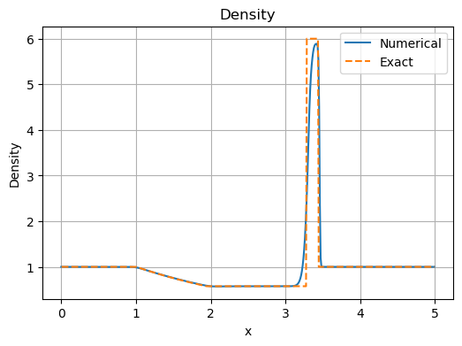
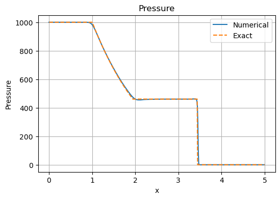
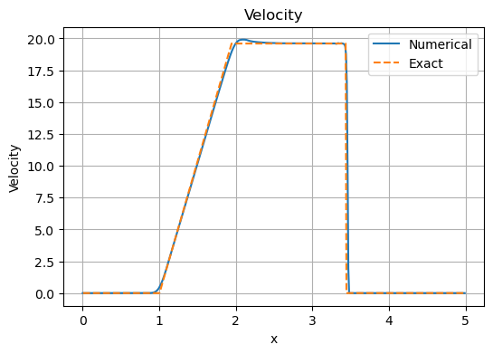
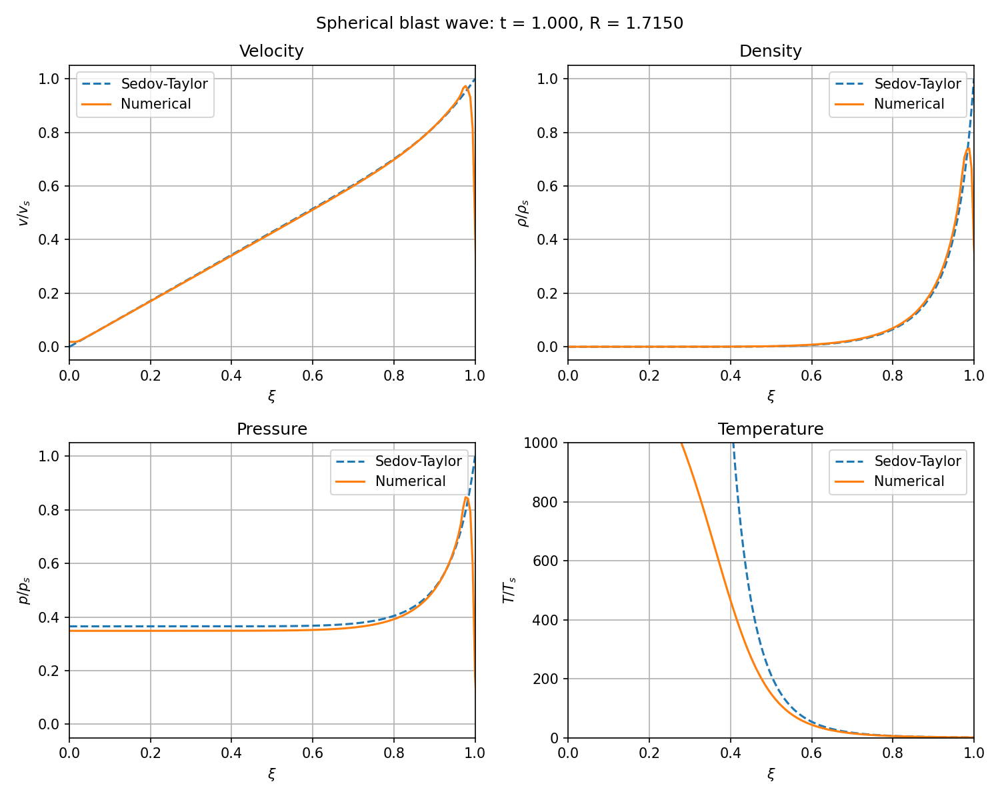

# Euler Equation Solver

## Overview

This project implements numerical solvers for the one-dimensional Euler equations using a finite-volume approach. It was initially developed as an educational project to explore the numerical treatment of compressible flows, shock waves, and discontinuous solutions.

The implementation includes both the Rusanov and HLL numerical fluxes, together with MUSCL reconstruction and a minmod slope limiter. 


## Validation

The solver was tested using several standard problems:

* **Sod shock tube**
* **Toro test cases 2 and 3**
* **Spherical blast-wave**

## Results

The final Toro test results below show the numerical solution obtained with the solver alongside the corresponding exact solution.

### Density



### Pressure



### Velocity



### Spherical blast-wave

The spherical blast-wave simulation shows the solution developing toward a self-similar profile over time.



Additional simulations and intermediate test results are kept in `results/other_tests/`, while the full evolution of the spherical blast-wave solution is shown in `results/sedov_snapshots/`.

## Repository Structure

```text
euler_solver/
├── src/
│   ├── euler_eq_solver.py
│   ├── hll_euler_eq_solver.py
│   └── self_similar_sphere.py
│
├── notebooks/
│   ├── sod_shock_tube.ipynb
│   ├── spherical_test.ipynb
│   ├── sphericat_test2.ipynb
│   ├── toro_2.ipynb
│   └── toro_3.ipynb
│
├── results/
│   ├── final/
│   ├── other_tests/
│   └── sedov_snapshots/
│
└── data/
    └── toro_3_exact.dat
```

`src/` contains the main solver implementations.
`notebooks/` contains test cases and exploratory calculations.
`results/` contains the main simulation outputs.
`data/` contains reference data used for validation.


